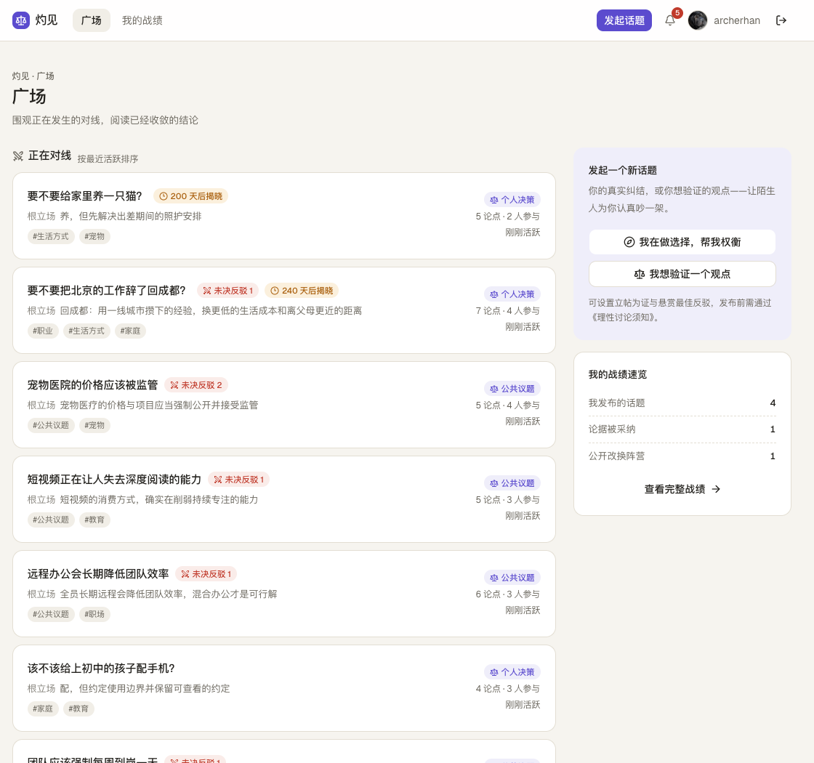
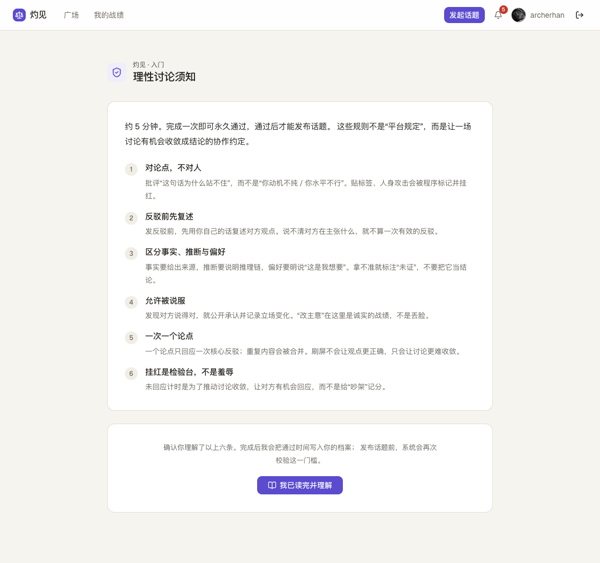
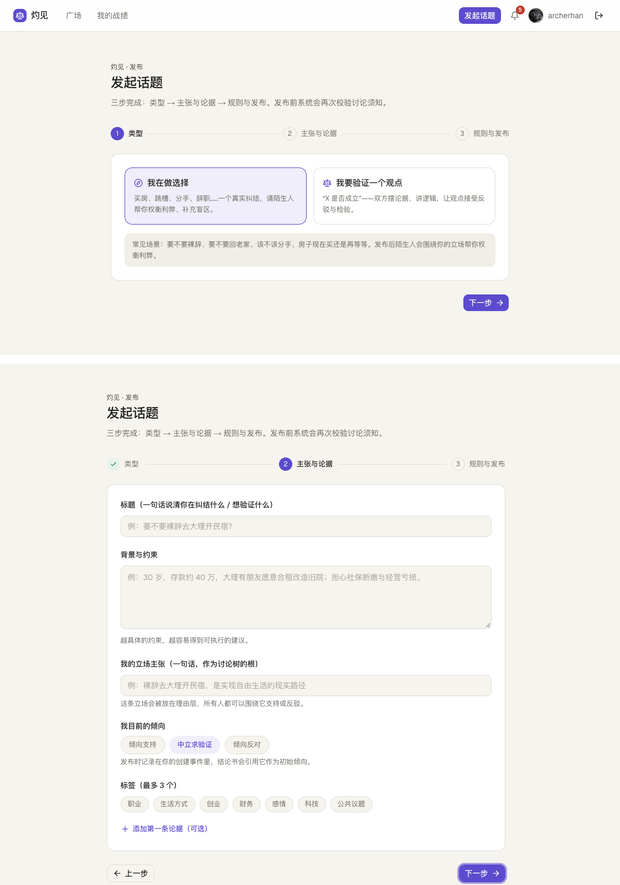
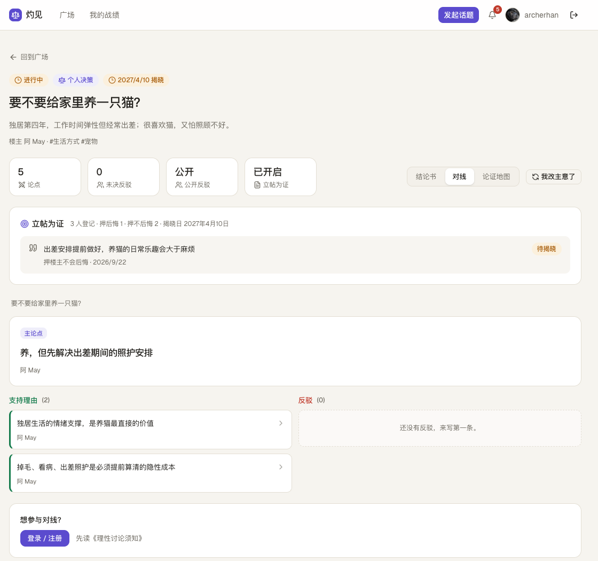
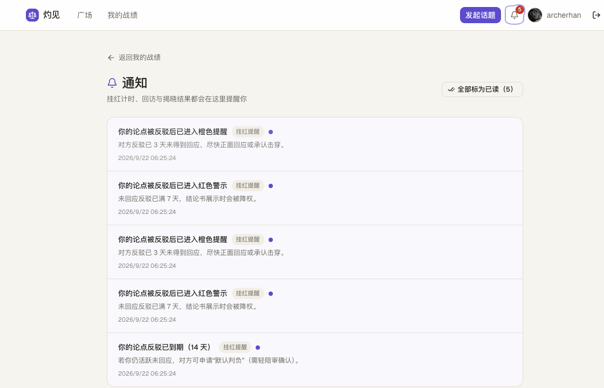
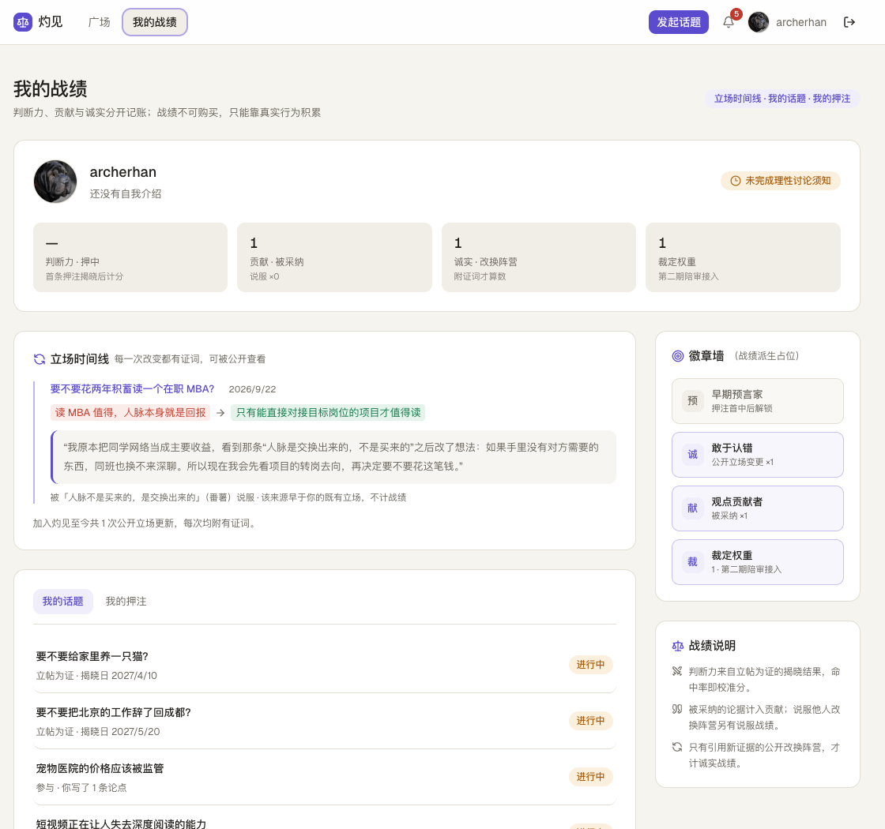

# 灼见（insight）

思想与立场的碰撞：让观点接受检验、让讨论沉淀结论、让"被说服"被记录。



> **项目状态：已暂停（2026-09-12）。** 代码、数据模型与设计文档全部保留；暂停原因见文中"然后我把它停了"一节，历史里程碑（M0–M5）见文末。
>
> 收尾动作：GitHub Actions 已停用（工作流文件重命名为 `*.disabled`，恢复时改回 `.yml` 即可）；代码状态冻结在标签 `pause-2026-09-12`。

## 为什么做

起点是一个帖子：如果给"AI 编程就是垃圾 / AI 编程能极大提高效率"这种对立话题设计一个界面，怎样才算好的对线体验？

我的答案是：现在社区奖励的是嗓门和情绪，不奖励"被说服"。打赢一场骂战很爽，但没有人真的改变想法，讨论也不留下结论——几天后同样的架在别的地方再吵一遍。

所以想做的其实是三件事：**让争论有形状，让不回应有代价，让"我改主意了"成为战绩。**

## 先立规矩



发帖之前必须过一遍六条规则（约 5 分钟，一次通过永久有效）：

1. **对论点，不对人**——批评"这句话为什么站不住"，而不是"你不行"。
2. **反驳前先复述**——说不清对方在主张什么，就不算一次有效的反驳。
3. **区分事实、推断与偏好**——事实给来源，推断讲推理链，偏好就明说"这是我想要的"。
4. **允许被说服**——发现对方说得对，公开承认并记录立场变化。
5. **一次一个论点**——重复内容会被合并，刷屏不会让观点更正确。
6. **挂红是检验台，不是羞辱**——计时是为了推动收敛，不是给吵架记分。

这不是挂在墙上的公约：程序会拿它做检查（复述覆盖度不够就不算有效反驳），发布动作也会在服务端二次校验这道门槛。

## 发起话题：三步



第一步选类型，只有两种：**我在做选择**（真实的个人纠结，请陌生人帮我权衡利弊、补盲区），或者**我要验证一个观点**（"X 是否成立"，靠论据和逻辑交锋）。

第二步把话说清楚：标题（一句话讲清你在纠结什么）+ 背景与约束 + **我的立场主张**（这句话会成为讨论树的根）+ 我目前的倾向（支持 / 中立验证 / 倾向反对）+ 最多三个标签 + 可选的第一条论据。

立场不是标签，是树根——后面所有的支持和反驳都挂在这句话上，谁都不能偷偷移动它。

## 对线：反驳必须先复述



想反驳？先用自己的话复述对方的观点。过不了复述检验，就不算一次有效的反驳。

通过了才算挂上：目标论点立刻进入"挂红"状态，开始 **3 / 7 / 14 天**倒计时——3 天橙色提醒，7 天红色并且结论书里自动降权展示，14 天可以申请"默认判负"，交给轻陪审确认。

楼主有两条路：**回应**（解除挂红，生成回应节点），或者**承认击穿**。承认不等于被否定得一无是处——被击穿的只是"作为论据的有效性"：它的支撑型子孙自动变成"悬空"（论据本身可能仍然为真，只是失去了论证目标），反驳型后代变成 moot（目标没了，不判胜负），而成功击穿的那条链会被提升到理由层。

还有一条"修订优先于判负"：被击穿之后可以出新版本，旧版存档，反驳继续对旧版有效。认错和修正被鼓励，而不是被打死。

## 结论书

一个话题收敛之后，产出的是结论书：只能采纳"理由层"的论点，采纳时冻结一条支撑链快照，连作者名一起存下来——以后改名也不会改写历史导出。存在未决反驳时不允许悄悄收尾，只能"带险关闭"：逐条勾选确认，风险写进快照，结论书里单列未决风险区。可以导出成 Markdown 分享。

## 被说服，要有证词

改换立场必须写证词：原来怎么想、哪条论据改变了你。它会作为公开记录留在个人页的立场时间线上，诚实 +1，而且豁免这一次的声望损失。

奖励是双向的：改主意的人拿到诚实战绩，说服他的人拿到"说服"战绩。两边都赢，平台上才没有人害怕被说服。

## 立帖为证：把判断交给时间

个人决策类话题可以在发布时立帖为证：一句话押注 + 揭晓日期，别人可以押你"会后悔"或"不会后悔"，楼主不能自押，开放数量和截止时间都有约束。

到期不是系统替你编一个结论，而是楼主回访作答（没后悔 / 部分后悔 / 后悔），据此结算押注、写进判断力战绩。挂红阶段、回访、揭晓都会推站内通知。



## 战绩



四个计数严格分开：**判断力**（押中多少）、**贡献**（论据被采纳多少）、**诚实**（公开改换过几次阵营）、**裁定权重**（做陪审的资格与分量）。

原则是：战绩不可购买、不可转让，只能靠真实行为和时间积累。内部另有一层"逻辑币"（可花费，用来发悬赏、押注、交陪审押金），和战绩严格分开——花钱不影响信誉。

## 裁判阶梯

谁有权改变树的状态？答案是分权，一共六级：

- **L0 程序**：查重、复述覆盖度、来源完整性、侮辱词识别——只标记和提示，AI 没有裁决权。
- **L1 作者/楼主**：采纳、修订、个人决策关闭。
- **L2 轻陪审**：3 人，48 小时，简单多数。
- **L3 重陪审**：5 人，72 小时，适用于折叠确认、公共主张关闭、扣战绩级惩罚。
- **L4 上诉陪审**：7 人，5 天，需付申诉押金；推翻原判要有人负责。
- **L5 时间/现实**：预测揭晓、决策回访、事实反转。

四条铁律贯穿全部：分权（没有任何一方拥有完整裁判权）、分级（判错代价越大门槛越高）、留痕可申诉（一切裁定进审计账本，除系统性作弊外都可逆）、AI 只有建议权。

## 怎么做的

把规则写成纯函数是这套东西能跑起来的关键：

- **领域层全是纯函数**：论点树（祖先链、重挂、提升）、节点状态机、击穿传播、计时、复述检查、课程门槛、立帖为证——每个模块配单测，核心分支覆盖率门槛 85%，全仓行覆盖 ≥70%（做到对线那期时到了 90%）。
- **服务层一个动作一个事务**：挂反驳会同时建节点、建 challenge、写 3/7/14 计时、把目标置为 challenged；承认击穿要连带处理悬空、moot 和击杀链提升。
- **计时不靠常驻进程**：读取路径惰性推进 + 每天一次 Cron 对账，事件幂等写入，漏一次也不会算错。
- **数据在 PostgreSQL**（Drizzle ORM）：树用邻接表 + 祖先链，depth 恒等于链长，有断言兜底。
- **认证两条路**：GitHub OAuth，以及邮箱验证码注册——验证码只存 HMAC 摘要、密码 scrypt 加盐、重置令牌一次性且只存摘要、登录注册找回都有内存限流。
- **部署**：一个 Dockerfile 出三个目标（约 200MB 的非 root 运行镜像、迁移用、构建用），compose 的顺序是 db → migrate → app → scheduler；自建 Nginx + Let's Encrypt 证书自动续期，镜像在 CI 构建后推到镜像仓库，服务器只负责拉取重启。

## 然后我把它停了

结论先写：**这不是技术问题，是单人扛不动一个公开 UGC 平台的内容审核与合规责任。**

**审核是地基层，不是附加项。** 公开注册意味着 7×24 的违法与有害内容处置、举报响应、应急上报和法务对接。我手上只有程序性检查（查重、复述检验、侮辱词提示），那不是审核队列、处置分级和申诉流程。

**合规风险不可压缩。** "立帖为证"一旦沾上体育竞猜、彩票、赔率或可兑换价值，就有被认定为赌博的风险；面向中国大陆用户的 UGC 平台还涉及实名、日志留存、内容安全负责人这些法定义务。这些需要专业评估，不是免责声明能盖住的。

**成本结构与个人开发不匹配。** 功能一个人做得完（M0–M5 全跑通了），但审核运营、内容安全 API、值班和法务是持续投入，而一旦出事后果严重。

所以在投入更多之前止损：代码冻结在标签 `pause-2026-09-12`，GitHub Actions 全部停用（工作流改成 `.disabled`，恢复时改回来即可），仓库和文档原样保留。

什么条件下会考虑重启：

- **形态先降风险**：邀请制闭门内测（无公开注册）、团队/企业决策工具（无公开 UGC），或"AI + 可信朋友"的个人决策助手；
- **补齐上线前必备**：自动审核 + 人工队列、品类黑名单（体育/彩票/金融荐股等）、举报与处置分级、申诉通道、18+ 与用户协议、法务评估；
- **有人一起扛**：内容安全/合规负责人 + 值班机制 + 预算（审核 API、法务），而不是单人开发。

## 已完成的资产（不会浪费）

- **设计与规则**：产品总览、裁判机制、奖惩机制、视觉呈现、数据库设计 v0.2、第一期实现计划；
- **可运行代码**：M0–M5（论点树与状态机、对线挂红/击穿/提升、结论书与导出、立场时间线、押注最小版、通知、认证与发布向导）；
- **工程化**：单元/集成测试与覆盖率门槛、CI、Docker Compose 与服务器部署手册；
- **关键结论**：审核是生死线、立帖为证有赌博风险、对线需要结算闭环——这些认识可复用到任何社区或决策类产品。

## 回头看

这个项目最值钱的可能不是代码，而是那几份设计文档：产品总览、裁判机制、奖惩机制、数据库设计、视觉呈现。它们把"怎么让讨论收敛"拆成了能实现的规则——每一条状态迁移凭什么发生、由谁决定、错了怎么纠正。

也认清了一件事：**机制设计一个人做得完，运营不行。** 上线一个公开社区，每一行代码背后都站着一个必须负责的人，而那个人不能是"下班以后的我"。

> 让讨论收敛，比让讨论热闹难得多。

## 技术栈

- Next.js（App Router）+ TypeScript
- TailwindCSS + shadcn/ui
- PostgreSQL 16（Docker 自建）+ Drizzle ORM
- Vitest + React Testing Library（单元/组件测试）
- ~~GitHub Actions（CI）→ Docker Compose（部署）~~（已随项目暂停停用）

## 目录

```text
src/
  app/              # 页面与 API（含定时任务入口 /api/cron/advance）
  db/               # Drizzle schema / client / 种子数据 / 树服务
  lib/domain/       # 纯领域函数：树、状态机、击穿传播、计时（带单测）
design/             # HTML 界面示意稿
docs/               # 产品与设计文档（含数据库设计 v0.2）
drizzle/            # 生成的 SQL 迁移
```

## 本地开发

```bash
cp .env.example .env.local    # 首次：填 CRON_SECRET、AUTH_SECRET、GitHub OAuth
openssl rand -base64 32       # 结果填入 .env.local 的 AUTH_SECRET
# 另需 GitHub OAuth：https://github.com/settings/developers → OAuth Apps
# 回调地址：http://localhost:3000/api/auth/callback/github
docker compose up -d --build  # 构建镜像 → 起库 → 自动迁移 → 起应用 + 定时任务
docker compose run --rm migrate pnpm db:seed   # 可选：写入两棵演示树（幂等）
open http://localhost:3000
```

只想在主机上跑代码、数据库留在 Docker 里：

```bash
docker compose up -d db       # 只起库（127.0.0.1:5432）
pnpm install
pnpm db:migrate               # .env.local 的 DATABASE_URL 需指向 localhost:5432
pnpm dev
```

常用命令：

```bash
docker compose ps                                        # 服务状态
docker compose logs -f app                               # 应用日志
docker compose exec db psql -U debate -d debate          # 进数据库
docker compose run --rm migrate pnpm db:migrate          # 容器内执行迁移
docker compose run --rm migrate pnpm db:demo             # M0 验收走查
docker compose down                                      # 停止（数据保留在 db-data 卷）
docker compose down -v                                   # 停止并清空数据库数据
```

`pnpm db:generate`（由 schema 生成迁移）在主机侧执行，产物提交到 `drizzle/`。

## Docker 部署（本地与阿里云同一套）

同一个 `Dockerfile` 产出三个目标：

| 目标 | 用途 | 说明 |
| --- | --- | --- |
| `runner` | 应用运行时 | 只含 Next.js standalone 产物，非 root 用户启动，约 200MB |
| `migrator` | 迁移 / 种子 | 带 drizzle-kit 与 tsx 的一次性任务，不进生产运行时镜像 |
| `builder` | 构建 | 构建期不连库（页面全是动态渲染），`DATABASE_URL` 用占位值 |

`docker-compose.yml` 的编排顺序：`db`（Postgres 16 + 数据卷）→ `migrate`（迁移成功才放行应用）→ `app`（对外 3000）→ `scheduler`（每日 03:00 UTC 调用 `/api/cron/advance`，替代 Vercel Cron）。

服务器上线（镜像由 GitHub Actions 构建推送到 ACR，服务器只负责拉取）：

```bash
APP_ENV_FILE=.env.production docker compose --env-file .env.production up -d --no-build
```

- 数据在 `db-data` 卷里，`docker compose down` 不会删；升级只重建 `app`；
- 迁移在每次 `up` 时自动执行（drizzle-kit 跳过已应用迁移），发布顺序天然安全；
- 外层用 Nginx/Caddy 反代到 `127.0.0.1:3000` 并签证书，GitHub OAuth 回调登记为 `{AUTH_URL}/api/auth/callback/github`。
- 完整上线手册见 [deploy/server-setup.md](deploy/server-setup.md)，生产环境变量模板见 [deploy/.env.production.example](deploy/.env.production.example)；
- 发布流水线见 [.github/workflows/deploy.yml.disabled](.github/workflows/deploy.yml.disabled)（已停用，保留以便重启）：main 上的 CI 通过后自动构建并推送 ACR，再 SSH 到服务器拉取重启。

质量门禁（CI 与本地一致）：

```bash
pnpm lint
pnpm typegen                   # 生成 .next/types 里的全局类型（LayoutProps 等），typecheck 依赖它
pnpm typecheck
pnpm test                      # 单元测试；设置 TEST_DATABASE_URL 后自动加入 DB 集成用例
pnpm test:coverage             # 全仓行覆盖率门槛 ≥70%（CI 跑在 Postgres 测试库上）
pnpm test:coverage:core        # 核心状态机/树操作分支覆盖率门槛 ≥85%
pnpm build
```

## M0 状态（已达成）

- 领域层：论点树祖先链/重挂、状态机迁移、击穿传播（悬空/moot/击杀链提升）、反驳计时 —— 已实现并有单测；
- 服务层：话题创建、挂反驳（自动建 challenge + 3/7/14 计时列）、回应、承认击穿（含自动传播与击杀链提升）、修订（supersedes）、抢救迁移/提升 —— 全部在事务内完成，depth 恒等于 ancestors 链长；
- 数据库：Neon 迁移脚本已执行；两棵演示树（裸辞去大理开民宿 / AI 编程是否提高效率）按"理由层 → 子论点 → 证据"幂等落库；
- 验收走查：`pnpm db:demo` 可把演示树从"反驳挂上"走到"击穿并自动提升击杀链顶端"，并打印 claim_events 时间轴；
- 计时：Cron 每日推进 3/7/14 天阶段（幂等写 claim_events），14 天后默认判负等治理动作按设计留待第二期陪审；
- 测试基座：Vitest + React Testing Library + 纯函数/组件/路由用例；CI 起 Postgres 测试库跑 DB 服务层集成测试；
- 覆盖率门槛：核心状态机与树操作分支 ≥85%，全仓（执行代码）行 ≥70%；
- UI 骨架：shadcn/ui（base-nova 风格）已初始化，占位首页/布局就位；
- CI：GitHub Actions（lint / typecheck / test / coverage / build），main 与 PR 全绿才可合并。**（已停用）**

## M1 状态（已达成）

- 认证：NextAuth（GitHub OAuth），首次登录即按 `auth_id` 创建 users 档案（`github:{id}`）；假名默认取 GitHub 名、头像随登录同步；
- 门槛：《理性讨论须知》占位页（六条讨论规则，约 5 分钟）完成即写 `course_completed_at`；`/topics/new` 未完成会自动转到须知页，领域层 `hasCompletedCourse / publishGateError` 供 M2 发布动作复用；
- 全局壳：顶栏 = 灼见品牌 + 导航（广场 / 我的战绩）+“发起话题”CTA + 登录/退出；议题页三视图切换组件（结论书 / 对线 / 论证地图，`?tab=` 深链）已就绪，M3 议题页接入；
- 路由占位：`/login`、`/guide`、`/me`（我的战绩）、`/topics/new`（发起话题向导骨架）；
- 设计 token：按《视觉呈现设计》落地暖纸底 / 紫品牌 / 语义色（pro/con/amber 等），浅深色各一套；
- 测试：Auth 建档回调、须知门槛、登录/守卫、顶栏与三视图组件、页面占位均有用例；users 服务集成测试在 CI 测试库自动运行。

### M1 环境变量（.env.local）

```bash
AUTH_SECRET=...            # openssl rand -base64 32
AUTH_URL=http://localhost:3000
AUTH_GITHUB_ID=...         # GitHub OAuth App Client ID
AUTH_GITHUB_SECRET=...     # GitHub OAuth App Client Secret
```

认证回调地址固定为 `{AUTH_URL}/api/auth/callback/github`；部署到服务器时把 `AUTH_URL` 换成正式域名，并在 GitHub OAuth App 中登记该回调。

### 邮箱登录 / 注册 / 忘记密码

- 登录方式：`/login` 同时提供邮箱密码与 GitHub 两种入口；
- 注册：`/register` → **邮箱验证码**（6 位数字，10 分钟有效、最多试 5 次，同一邮箱 60 秒一次、每小时最多 5 次）+ 昵称 + 密码（至少 8 位且含字母和数字）→ 验证码核销后才建档，密码以 scrypt 加盐哈希落库（`users.password_hash`）→ 注册成功自动登录并进入须知页；验证码只存 HMAC-SHA256 摘要（密钥 AUTH_SECRET），库里拿不到明文；
- 忘记密码：`/forgot-password` → 不区分邮箱是否存在，统一提示，避免枚举注册账号；命中后签发一次性令牌（只存 sha256 摘要，60 分钟有效）并发送重置邮件；
- 重置密码：`/reset-password?token=…` → 校验令牌有效性与有效期 → 单事务内「令牌置为已用 + 写入新密码」；成功后跳转登录页；
- 会话安全：重置密码会刷新 `users.password_changed_at`，签发时写入 JWT 的旧会话会在下一次请求被判为失效（`src/lib/auth/session.ts`）；
- 防滥用：登录 / 注册 / 找回密码都做了内存限流（单实例部署够用，多实例时替换 `src/lib/auth/rate-limit.ts` 的实现即可）；
- 邮件：优先 Resend（`RESEND_API_KEY` + `MAIL_FROM`，免费 3000 封/月），也支持通用 `SMTP_*`（阿里云邮件推送等）；本地未配置时邮件内容打印到控制台，生产未配置时注册/找回密码会明确报"邮件服务尚未配置"；`pnpm mail:test you@example.com` 可一键验证发信通道；
- 已知限制：邮箱账号与 GitHub 账号目前各自独立（同一人用两种方式登录会得到两个档案），账号绑定留待后续迭代。

## M2 状态（已达成）

- 广场首页：正在对线（含未决反驳/参与人数/根立场/标签）、最新结论书（仅 published 版本 + 采纳条目数）、立帖为证·即将揭晓（未来 reveal_at）、右侧"我的战绩速览"（派生计数）与登录引导；全部按公开读从真实表聚合，不依赖可能失真的反规范化列；
- 发起话题：三步向导（类型 → 主张与论据 → 规则与发布），含类型卡、根立场、倾向、标签（≤3）、首条论据（可选）、立帖为证揭晓日期、悬赏/公开反驳开关与发布预览；
- 发布动作：登录 + 《理性讨论须知》门槛在 Server Action 二次校验，草稿规则由纯函数（`src/lib/domain/publish.ts`）校验，`topic + 理由层根立场 + 可选 evidence + tags` 单事务落库（`src/db/services/publish.ts`），成功后跳转话题落点页；
- 话题落点页：`/topics/[id]` 公开读话题、楼主、根立场与统计（对线视图由 M3 接入，见下）；
- 种子数据补充标签；广场查询（`plaza.ts`）与话题读（`topics.ts`）均有 CI 测试库集成用例，向导/动作/页面有组件与单测。

详细计划见 [第一期实现计划](docs/第一期实现计划.md)，页面示意稿在 `design/`。

## M3 状态（已达成）

对线核心（里程碑中的最高风险项）已接入，两账号可走通“反驳 → 未回应挂红（3/7/14 天阶段）→ 回应或承认击穿”的完整链路：

- **对线视图**：议题页按状态落默认视图（进行中 → 对线；已收敛 → 结论书占位），`?tab=arena&claim=` 支持焦点深链；面包屑逐级回跳、焦点卡、支持理由/反驳两栏、澄清请求（预留）、子卡状态 chip 与“未决反驳 N”计数；
- **发反驳流程**：先复述对方观点 → L0 程序检查（复述覆盖度/查重/侮辱，本地启发式默认开，LLM 经 `AI_PROGRAM_LLM_*` 环境开关增强）→ 通过后单事务建 con 节点 + challenge 挂红（3/7/14 天计时列），目标论点置 challenged；
- **作者侧**：未决红条内可直接“回应”（解除挂红、建回应节点）或两步确认“承认击穿”（refuted + 支撑型子孙自动悬空 + 反驳型后代 moot + 击杀链顶端提升为理由层）；焦点卡支持“修订观点”（supersedes）；新版焦点列出旧版可抢救的悬空子论点，作者本人可一键迁移；
- **程序留痕**：每次新建论点的程序检查（含通过项）落 `ai_flags`（本地 heuristic-v1 / LLM llm-v1），未通过不建节点只留审计；服务端为权威校验，客户端复述检验只是前置体验；
- **计时兜底**：`advanceChallengeTimersForTopic` 在读取路径惰性推进（幂等补写 orange/red/due 的 `challenge_timer` 事件），Cron 仍每日全局对账；
- **未决风险查询**：`getUnresolvedChallenges` 返回 open 反驳（反驳原文/目标论点/阶段/天数），为 M4 结论书“未决风险区与降权展示”备好数据源；
- **防护与一致性**：不允许反驳自己的论点、回应仅限被反驳论点作者、迁移/提升仅限论点作者、已回应后可再承认击穿、承认一条后同目标其它 open 反驳自动 moot、话题收敛后拒绝新论点；
- **测试**：对线写/读服务与树服务新增 25 条集成用例（覆盖验收链路、拦截、权限、多反驳 moot、抢救迁移、惰性计时）；动作层 11 条单测；输入条/红条/修订/抢救组件 12 条交互用例；复述检查/展示口径/LLM 编排等 40 条单测；全仓覆盖率（含 DB）行 ≥90%。

### M3 环境变量（默认启发式，LLM 可选）

```bash
AI_PROGRAM_LLM_ENABLED=false     # true 时启用 LLM 程序检查增强
AI_PROGRAM_LLM_URL=              # OpenAI 兼容 chat completions 地址
AI_PROGRAM_LLM_API_KEY=          # 对应密钥
AI_PROGRAM_LLM_MODEL=gpt-4o-mini
```

未启用/未配置/调用失败均自动降级为本地启发式结果，不阻塞用户。

## M4 状态（已达成）

- 采纳与出结论书：楼主只可采纳理由层论点（深层须经提升通道），写入 conclusion_items 并冻结 support_chain 快照（作者名一并快照，改名不改写历史导出）；
- 带险关闭：存在未决反驳时须逐条勾选，topic 落 `risk_closed`，风险快照进 summary_snapshot，结论书视图展示未决风险区；
- 导出：`/topics/[id]/conclusion.md` 简要版 Markdown（正文 + 采纳理由 + 支撑链 + 未决风险）；
- 立场变更：`recordStanceChange` 单事务完成 novelty 校验 → stance_changes → claim_events(stance_changed) → 诚实/说服战绩，个人页立场时间线（带证词）已上线；
- 测试：结论书/立场服务集成用例、动作层、向导/页面用例随 M4 全绿。

## M5 状态（已达成）

第一期业务闭环收尾（战绩、押注最小版与通知）：

- **数据层**：迁移 0001 新增 `predictions` / `reality_checks` / `decision_followups` / `notifications` / `user_stats`（战绩为可重算物化表，源在账本与事件表）；
- **立帖为证登记**：开启立帖为证的个人决策话题可在话题页登记（一句话押注 + 押后悔/不后悔），一人一话题一次、开放数量封顶、楼主不可自押、揭晓日后截止；`topics.prediction_count` 随登记/作废维护，广场“即将揭晓”继续按公开读展示；
- **回访与揭晓**：出结论书即在单事务内生成 T+30 `decision_followups`；到期 worker（Cron/读取兜底）幂等发站内提醒；楼主回访作答（没后悔/部分后悔/后悔）→ 写 `reality_check` → 批量结算押注（部分后悔双方作废）→ `prediction_result` 战绩 + 揭晓通知 + claim_events(reality_changed) 留痕；
- **战绩页**：判断力（押注命中率）、贡献（被采纳/说服）、诚实、裁定权重 1 的计数卡；立场时间线保留；新增“我的话题 / 我的押注”Tab 与战绩派生徽章占位；
- **通知最小集**：挂红阶段提醒（orange/red/due，幂等）、回访提醒、揭晓提醒与揭晓结果；顶栏铃铛未读角标 + `/notifications` 站内收件列表（一键全部已读）；按 (user, type, dedupe_key) 幂等去重；
- **worker 入口**：`/api/cron/advance` 现同时推进挑战计时与回访/揭晓提醒；
- **测试**：领域纯函数 15 条；押注/回访/通知/战绩/worker 的服务集成用例随 CI 测试库运行；组件、页面与动作层用例覆盖登记、回访作答、Tab 切换、通知列表；lint / typecheck / 单测 / build 全绿。

揭晓语义说明：现实的“后悔与否”只有楼主能回答，因此最小版由回访作答触发结算（`reality_checks.decided_by=user`），worker 负责在到期日把“该揭晓了”推给楼主的押注者，而不是伪造自动结论。
